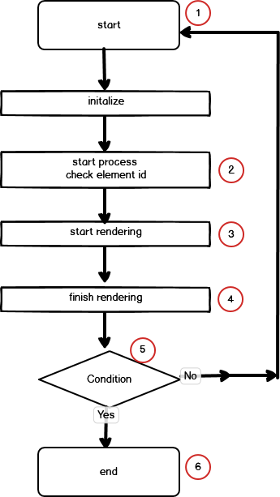

# Split window 

### Condition
1. User can select grid type randomly, one grid, two or three or four.
2. Grid type1 is selected, then html element id is element1, which can be a canvas area for drawing.
3. Grid type2 is selected, then html elements are element1 element2, each elements is passed to next process sequencially.
4. Grid type2 is selected, process of element2 have to wait until element1 is completing rendering process.
5. Each split window has multiple images, which is got from server by async communication.
6. Each split window display only one image and others are cached
7. When multi grid type is selected, while the previous split window start to cache after displaying the first image of previous canvas, next split window start to rendering process.


For each split window has it's own element id like as ( element1, element2, element3, element4)

- case 1: One split window (Grid type 1),
	With defined grid size, template and element id, start to image rendering.
- case 2: Multi split window. (Grid type 2, Grid type 3, Grid type 4)
	1. With defined grid size, template and element id, start to rendering from the first split window.
	 2. The next split window wait until the previous split window completing rendering.

---

- diagram #2

Using zip operator (rxjs) to wait the next process complete.

- case1: One split window.
1. Just after taking grid type, start rendering. 

- case2: Multi split window. refer above diagram #2 ( waiting process for completing previous element)
1. isStartedRendering: status of starting rendering. Should check if element id of previous split window is the same with id of isFinishedRendering$ value. 
2. isFinishedRendering: status of complete rendering (drawing the firest image). 
3. above circle #1(step 1). and circle #2 (step 2). job is completed, then circle #3 is ready to activate (meaning it becomes active observable)
4. When user select grid type  (Grid type 2, Grid type 3, Grid type 4), create this observable (circle #4) for waiting above circle #3(step 3). circle #4 (observable) is made when user select grid type, and made observable for each split window. 
5. After circle #3(step3) and circle #4(step4) is completing, it means one of split window processing is ready to start.

---

diagram #3.

1. Start with new html element id
2. currentCtViewerElementId$: Observale that get the signal of start or end rendering.
3. isStarted$
4. isFinished$
5. Check if this is the final process of grid no. if not, continue next split window process. 
6. End of rendering split window 

---

source program.
```ts
    splitWindowsProcess1() {
	const isFinished$ = this.getCurrentSplitOperation$.pipe( // 1 To know the end of image processing
		switchMap((val:any) => {
			this.splitService.selectedElement = val.element; // 2
			return this.splitService.isFinishedRendering$[val.element].pipe(take(1));
		}),
		take(1), // 3
	);

	const isStarted$ = this.getCurrentSplitOperation$.pipe( // 4 To know the start of image processing
		switchMap((val: any) => {
			this.splitService.selectedElement = val.element;
			return this.splitService.isStartedRendering$[val.element].pipe(take(1));
		}),
		take(1),
	);

	if (this.splitMode > 1) {
		if (this.splitService.selectedElement === 'element1') { // 5 first split window
			this.tempObservable = defer(() => of(EMPTY).pipe());
		} else if (this.splitService.selectedElement === 'element2') {
			this.tempObservable = zip(isStarted$, isFinished$).pipe( //['element2','element1']
					filter((val: any) => val[1] === 'element1') // 6 
			);
		} else if (this.splitService.selectedElement === 'element3') {
			this.tempObservable = zip(isStarted$, isFinished$).pipe( //['element3','element2']
					filter((val: any) => val[1] === 'element2'),
			);
		} else if (this.splitService.selectedElement === 'element4') {
			this.tempObservable = zip(isStarted$, isFinished$).pipe( //['element4','element3']
					filter((val: any) => val[1] === 'element3'),
			);
		}
	} else {
		this.tempObservable = defer(() => of(EMPTY).pipe()); // 7
	}

    }

```

```ts
    splitWindowProcess2() {
	const rendering$: Observable<any> = this.requestRenderingSplitWindow$[this.splitService.selectedElement];
	// 8
	zip(this.tempObservable, rendering$).pipe( // 9
			take(1),
	).subscribe(([temp, element]) => {
		/** Start processing ct-viewer after finished processing for previous split window*/
		const idx = this.splitService.elements.findIndex(val => val === element)
		this.splitService.selectedElement = element;
		/** When change split mode, need to set the first signal to prepare processing
		 * because each split window do process one by one */
		this.store.dispatch(new SetCurrentSplitOperation({element: this.splitService.selectedElement}));

		this.makingSplitWindowBySelectedSeries(this.categoryIdx); // 10
	});
  }
```
- refer above snippet. below sequence no is the comment no of above snippet.	
1. getCurrentSplitOperation$, when process arrive at the proper position (like step 2 of diagram #3) of checking then make observable when the this.splitService.isFinishedRendering$[val.element] is arrived. 
2. then reserve element id, which can tell which split window is processing. 
3. and wait process reach the final state, because it was wrapped with switchMap.
4. Same as above step 1,2,3 except waiting the process reach the start state.
5. If multiple grid type is selected, start to check from first grid.
6. Because this is the second split window, element of previouse split window must be element1. (isFinished$ === element1, isStarted$ === element2), 
7. When Grid type1 is selected (one split window), there is no need to step5 and step 6.
8. Make observable for each element for waiting rendering previous split window, which can be used parameter of zip operator (rxjs),  
9. rendering$ and tempObservable can be the signal of rendering split window by the zip operator. 
10. Start processing (drawing image) after finished processing for previous split window  
